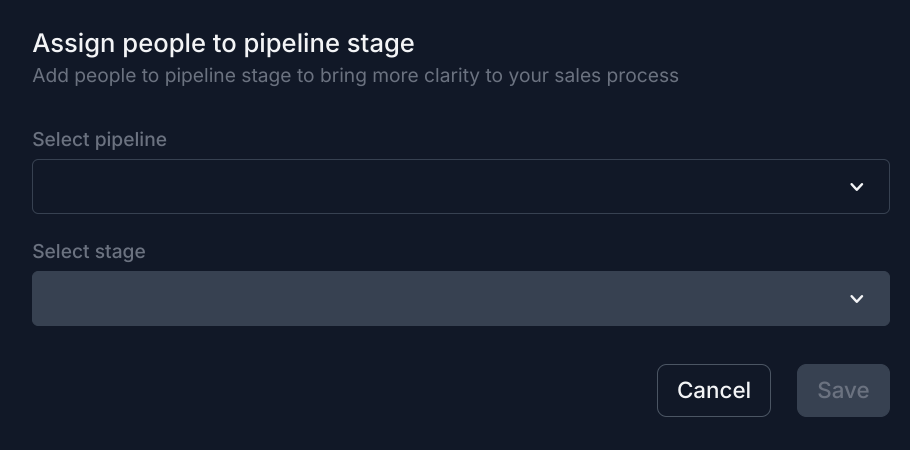

# Bonzo Data Extraction Tool

This project provides a Python-based tool for extracting and querying data from the Bonzo API. It leverages the dlt (Data Loading Tool) library to create a data pipeline that dynamically queries the Bonzo API based on user input, specifically focusing on extracting prospects associated with a given pipeline stage. The tool is designed to be a proof of concept (POC) for interacting with the Bonzo API, showcasing the ability to quickly and efficiently pull records associated with the authenticated user's API key.


## Features

- **Dynamic API Key Input:** Allows users to input their Bonzo API key at runtime, ensuring that data extraction is performed under the correct authentication context.
- **Pipeline Stage Querying:** Users can specify the pipeline stage for which they wish to query prospects, making the tool flexible for various data extraction needs.
- **Streamlit Integration:** The extracted data can be viewed and analyzed using Streamlit, providing a simple yet powerful interface for data exploration and querying.
- **Fast and Efficient:** The tool is capable of checking a large number of records in a short amount of time, returning only the records assigned to the user associated with the provided API key.


## Preparing Target Prospects in Bonzo for Extraction

To effectively use the Bonzo Data Extraction Tool for targeting specific prospects, follow these steps within your Bonzo account to prepare your data, particularly for extraction of a large amount of records at once:

**Note: if you already have a target pipeline id stage in mind, and prospects in it - skip this step - moving prospects in mass out of pipeline stages is not reversible with ease, user beware**

1. **Select Target Prospects in Bonzo:** Begin by navigating to the People View in your target Bonzo account. Here, you can identify and select the prospects you wish to target.


2. **Move Prospects to a Staging Stage:** After identifying your target prospects, move them to a "Staging" stage using the Pipeline Stage Move button at the bottom of the People View once you have selected your records in mass. 

The stage you select should be one that does not trigger any automations (a safe stage), ensuring that your actions do not inadvertently affect your prospects. This preparation step is crucial for cleanly extracting the data without impacting your ongoing marketing or sales processes.

    

3. **Notate the Stage ID:** To extract prospects from this specific stage, you'll need the stage ID. Navigate to `Pipelines` > click on the gear icon in the top right-hand corner to open options > select `Manage Stages`. Then, click on the "Staging" stage. The URL in your browser's address bar will change to include the stage ID. Note this ID as it will be required when using the extraction tool.

    

    ```plaintext
    Example URL: http://app.getbonzo.com/pipelines/stages/12345
    Focus on the Stage ID: 12345
    ```

    

By following these steps, you prepare your target prospects in Bonzo for extraction. Once the prospects are staged appropriately, you can use the Bonzo Data Extraction Tool to specify the stage ID during the extraction process. 

This allows for a focused extraction of data, enabling further analysis, querying, and downloading of the list directly from the data application our project provides. As we continue to develop and add resources to the pipeline, these capabilities will expand, offering more robust data manipulation and analysis options.


## Prerequisites

Before you begin, ensure you have met the following requirements:

Install the dlt package by following the official installation guide: [dlt Installation Guide](https://dlthub.com/docs/reference/installation)


- Python 3.9 or higher
- A virtual environment for Python (recommended)
- An API key for the Bonzo API

## Installation

1. Clone the repository to your local machine:
2. Navigate to the project directory:
3. Install the required Python packages:

## Usage

To use the Bonzo Data Extraction Tool, follow these steps:

1. Run the `rest_api_pipeline.py` script:
2. When prompted, enter your Bonzo API key.
3. Next, enter the pipeline stage for which you wish to query prospects.

The script will execute the data extraction process and output the results. To view and analyze the extracted data, use the Streamlit interface by running:


```python
    dlt pipeline rest_api_bonzo show
```


dlt pipeline rest_api_bonzo show


## Extending Functionality for Multiple Users

To extend the functionality of this tool to extract prospects for all users by rotating the API key and requerying until all users are processed, you could implement a loop that iterates through a list of API keys. After each iteration, the extracted data for each user can be stored in a temporary data structure (like a list or a dictionary). Once all iterations are complete, these individual datasets can be merged into a single dataset for analysis.

This approach would involve:

1. Storing all API keys in a secure manner, ensuring they are accessible during runtime.
2. Modifying the script to accept an API key as an argument or to iterate through a predefined list of keys.
3. Implementing logic to merge the data extracted from each API key into a unified dataset.

This could be achieved programmatically with modifications to the existing Python script, ensuring minimal manual intervention and a streamlined process for data extraction across multiple users.

## Roadmap

As the Bonzo Data Extraction Tool evolves, we aim to enhance its functionality and usability to better serve the needs of our users. Below are key areas we plan to focus on in the upcoming phases of development:

- **Standardized Queries for Business Logic:** We plan to implement a set of standard queries that cater to common business logic scenarios encountered with Bonzo exports. This will allow users to quickly and efficiently extract meaningful insights without the need for custom query development.

- **Expansion of Resources and Use Cases:** As we gather feedback and identify new use cases, we will expand the tool's capabilities to support a broader range of data extraction and analysis needs. This includes adding support for additional Bonzo API endpoints and data types.

- **Enhanced Data Analysis Features:** To further empower users to derive actionable insights from their data, we will integrate more advanced data analysis and visualization features. This may involve deeper integration with tools like Streamlit or the incorporation of machine learning models for predictive analytics.

- **Improved User Experience:** User feedback is invaluable to our development process. We will continuously seek to improve the tool's ease of use, documentation, and setup process to ensure a seamless experience for all users.

- **Security and Performance Enhancements:** Ensuring the security and efficiency of the data extraction process will remain a top priority. We will implement additional security measures and optimize the tool's performance to handle larger datasets and more complex queries.

- **Community-Driven Development:** We encourage the community to contribute ideas, use cases, and feedback. Engaging with our user base is crucial for identifying the features and improvements that matter most.

This roadmap is a living document and will be updated as we progress in our development journey. We are excited to build a robust tool that grows with the needs of our community and enhances the way businesses interact with Bonzo data.


## Contributing to the Project

Contributions to improve the Bonzo Data Extraction Tool are welcome. Please follow these steps to contribute:

1. Fork the repository.
2. Create a new branch: `git checkout -b <branch_name>`.
3. Make your changes and commit them: `git commit -m '<commit_message>'`.
4. Push to the original branch: `git push origin <project_name>/<location>`.
5. Create the pull request.


## Contact

If you have any questions or feedback, please contact the project maintainers at ian@getbonzo.com.

## License

This project is licensed under the GNU General Public License v3.0 - see the LICENSE file for details.

---

Remember to replace placeholders like your-username, your-project-name, your_streamlit_app.py, and your-email@example.com with your actual project details.